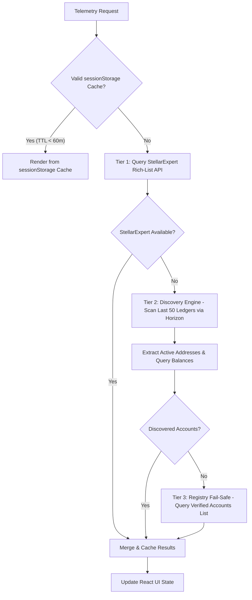
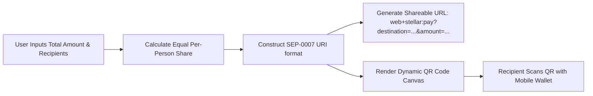
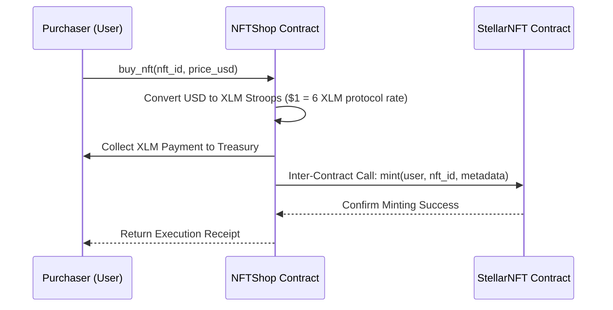

# 🚀 Stellar Network Payment Terminal (Terminal dApp) — Master Documentation

Welcome to the official, end-to-end documentation for the **Stellar Network Payment Terminal dApp** (also known as *The Survivor Hub / Stellar Management Hub*). 

This document provides a comprehensive technical reference covering system architecture, Soroban smart contracts, interactive CLI terminal, utility services, frontend features, security testing suites, installation instructions, deployment procedures, and troubleshooting.

---

## 📋 Table of Contents

1. [Executive Overview & Key Features](#1-executive-overview--key-features)
2. [Tech Stack & Architecture](#2-tech-stack--architecture)
   - [2.1 Technology Stack](#21-technology-stack)
   - [2.2 High-Level Architecture](#22-high-level-architecture)
   - [2.3 Triple-Redundant Leaderboard (Hunters Protocol)](#23-triple-redundant-leaderboard-hunters-protocol)
   - [2.4 SEP-0007 Request-to-Pay Split Bill Engine](#24-sep-0007-request-to-pay-split-bill-engine)
3. [Soroban Smart Contract Directory](#3-soroban-smart-contract-directory)
   - [3.1 Deployer Identity & Network Specs](#31-deployer-identity--network-specs)
   - [3.2 TranscendenceContract (Relief Fund Pool)](#32-transcendencecontract-relief-fund-pool)
   - [3.3 StellarNFT (NFT Token Contract)](#33-stellarnft-nft-token-contract)
   - [3.4 NFTShop (Marketplace & Inter-Contract Calls)](#34-nftshop-marketplace--inter-contract-calls)
   - [3.5 Contract Verification Checksums](#35-contract-verification-checksums)
4. [User Interface & Feature Modules](#4-user-interface--feature-modules)
   - [4.1 Multi-Wallet Uplink Gateway](#41-multi-wallet-uplink-gateway)
   - [4.2 Dystopian CRT Terminal & Visual Design Tokens](#42-dystopian-crt-terminal--visual-design-tokens)
   - [4.3 Persistent Multi-Theme Engine](#43-persistent-multi-theme-engine)
   - [4.4 Multi-Pay Batch Payment Processor](#44-multi-pay-batch-payment-processor)
   - [4.5 Soroban Relief Protocol & Live Event Telemetry](#45-soroban-relief-protocol--live-event-telemetry)
   - [4.6 NFT Marketplace (Level 4 Glassmorphism)](#46-nft-marketplace-level-4-glassmorphism)
   - [4.7 Admin Diagnostics & Security Testing Suite](#47-admin-diagnostics--security-testing-suite)
   - [4.8 Offline Transaction Sandbox & Fee Estimator](#48-offline-transaction-sandbox--fee-estimator)
5. [Interactive Terminal CLI Reference](#5-interactive-terminal-cli-reference)
   - [5.1 CLI Command Table](#51-cli-command-table)
   - [5.2 Terminal Formatting & History Buffer](#52-terminal-formatting--history-buffer)
6. [Utility Services & Core Modules](#6-utility-services--core-modules)
   - [6.1 PriceService.js (Oracle Calibration)](#61-priceservicejs-oracle-calibration)
   - [6.2 ansiFormatter.js (ANSI Terminal Parser)](#62-ansiformatterjs-ansi-terminal-parser)
   - [6.3 commandHistory.js (Deduplication Buffer)](#63-commandhistoryjs-deduplication-buffer)
   - [6.4 filterHelper.js (Search & Filter Logic)](#64-filterhelperjs-search--filter-logic)
   - [6.5 retryHelper.js (Exponential Backoff Resilience)](#65-retryhelperjs-exponential-backoff-resilience)
   - [6.6 kit.js (StellarWalletsKit Abstraction)](#66-kitjs-stellarwalletskit-abstraction)
7. [Installation & Setup Guide](#7-installation--setup-guide)
   - [7.1 Prerequisites](#71-prerequisites)
   - [7.2 Installation Commands](#72-installation-commands)
   - [7.3 Environment Variables](#73-environment-variables)
   - [7.4 Running Locally](#74-running-locally)
   - [7.5 Production Build](#75-production-build)
8. [Smart Contract Compilation & Deployment](#8-smart-contract-compilation--deployment)
   - [8.1 Compiling Rust Soroban Contracts](#81-compiling-rust-soroban-contracts)
   - [8.2 Automated Node Deployment Script](#82-automated-node-deployment-script)
9. [Automated Vitest Suite](#9-automated-vitest-suite)
10. [Troubleshooting & FAQs](#10-troubleshooting--faqs)

---

## 1. Executive Overview & Key Features

The **Stellar Network Payment Terminal** is a high-density, web-based decentralized terminal application designed for the **Stellar Testnet** and **Soroban Smart Contract Engine**. Styled with a dystopian Cyberpunk/CRT aesthetic, the platform unifies real-time payment settlement, batch execution, decentralized relief funding, multi-contract NFT trading, live network telemetry, and on-chain security verification.

### Core Capabilities:
- **Unified Multi-Wallet Uplink**: Native integration with Freighter, Rabe, Hana, xBull, and Albedo via `@creit.tech/stellar-wallets-kit`.
- **Soroban Relief Fund Protocol**: Smart contract-governed fund pooling (`TranscendenceContract`) with transparent goal tracking and withdrawal authorization.
- **Multi-Contract NFT Ecosystem**: Inter-Contract Call (ICC) architecture separating asset minting (`StellarNFT`) from shop USD pricing logic (`NFTShop`).
- **SEP-0007 Request-to-Pay Split Engine**: Generates shareable `web+stellar:pay` URIs and dynamic QR codes for instant communal bill splitting.
- **Multi-Pay Batch Script Processor**: Executes parallel transfers to multiple recipients in a single operation with per-recipient status monitoring.
- **Admin Diagnostics & Security Testing Suite**: Admin-only panel that interacts directly with Soroban RPC to test Wasm contract security bounds (Malicious init blocking, Auth traps, Emergency Pause, Admin reassignment).
- **Hunters Protocol (Triple-Redundant Leaderboard)**: Multi-tiered whale discovery scanning Horizon ledgers when indexer APIs fail.
- **Dystopian Visual Engine & Persistent Multi-Themes**: CRT scanline effects, glassmorphic bento grids, and 4 persistent themes (Slate, Matrix, CRT Amber, Cyber Deep).

---

## 2. Tech Stack & Architecture

### 2.1 Technology Stack

| Layer | Component | Version / Standard | Purpose |
| :--- | :--- | :--- | :--- |
| **Frontend Framework** | React | `^19.2.4` | Component tree & state management |
| **Build Tooling** | Vite | `^5.4.11` | Hot module replacement & bundling |
| **Stellar SDK** | `@stellar/stellar-sdk` | `^15.0.1` | Horizon API, XDR creation, RPC client |
| **Wallet Abstraction** | `@creit.tech/stellar-wallets-kit` | `^1.9.5` | Unified multi-wallet connection modal |
| **Direct Freighter Integration** | `@stellar/freighter-api` | `^6.0.1` | Freighter browser extension provider |
| **Unit Testing** | Vitest | `^2.1.8` | Test runner for utilities and logic |
| **Smart Contracts** | Rust / Soroban SDK | `wasm32v1-none` | On-chain Wasm logic on Stellar Testnet |
| **Payment Standard** | SEP-0007 | `web+stellar:pay` | Standardized QR/URI payment requests |

---

### 2.2 High-Level Architecture

```
                                 ┌─────────────────────────────────────────┐
                                 │       React + Vite Frontend (UI)        │
                                 └────────────────────┬────────────────────┘
                                                      │
                       ┌──────────────────────────────┼──────────────────────────────┐
                       │                              │                              │
          ┌────────────▼────────────┐    ┌────────────▼────────────┐    ┌────────────▼────────────┐
          │   StellarWalletsKit     │    │     Horizon RPC Client  │    │    Soroban RPC Client   │
          └────────────┬────────────┘    └────────────┬────────────┘    └────────────┬────────────┘
                       │                              │                              │
         ┌─────────────┴─────────────┐                │                  ┌───────────┴───────────┐
         │ Freighter / Rabe / xBull  │                │                  │  Soroban Testnet RPC  │
         └─────────────┬─────────────┘                │                  └───────────┬───────────┘
                       │                              │                              │
                       │                       ┌──────▼──────┐                       │
                       │                       │ Horizon Node│                       │
                       │                       └──────┬──────┘                       │
                       │                              │                              │
                       └──────────────────────────────┼──────────────────────────────┘
                                                      │
                                           ┌──────────▼──────────┐
                                           │   Stellar Ledger    │
                                           └─────────────────────┘
```

---

### 2.3 Triple-Redundant Leaderboard (Hunters Protocol)

To guarantee high availability for rich-list telemetry without triggering Horizon rate limits, the system employs a three-tier fallback pipeline:



---

### 2.4 SEP-0007 Request-to-Pay Split Bill Engine

The Split Bill Engine enables instant communal expense sharing using the standardized `web+stellar:pay` URI scheme:



---

## 3. Soroban Smart Contract Directory

### 3.1 Deployer Identity & Network Specs
- **Deployer Alias**: `rupsa`
- **Deployer Public Address**: `GBJB6GI3RUZGFRHXXTGW6CR646DV64BHJEVOTQFKLZMU6OF4QJHKFJOQ`
- **Target Network**: Stellar Testnet (`Test SDF Network ; September 2015`)
- **Primary Horizon URL**: `https://horizon-testnet.stellar.org`
- **Primary Soroban RPC**: `https://soroban-testnet.stellar.org`
- **Secondary Soroban RPC**: `https://rpc-futurenet.stellar.org`

---

### 3.2 TranscendenceContract (Relief Fund Pool)
- **Role**: Core decentralized protocol for pooling relief funds, tracking donations, and managing admin withdrawals.
- **Contract ID**: `CB73TNAHPLIHS2FPCNCUERLDUEPA4QPYA2CSCSV6PFVZMSCI47ESKSLJ`
- **Wasm Hash**: `0a09d7115baa8e9586a944790ad212b3f02d9b5b18a71e3d9b302a9b4c703497`
- **Deployment Tx**: `f3f66c85cb3cb514ce9a8c00d5e75dbbc731190650babecbf0c60e02f8172175`
- **Initialization Tx**: `6762cd5e9759e934ba7330f81370fefba7631a415638c6e1d40be02e37ec8338`

#### Methods Exposed:
1. `init(admin: Address, token: Address, target_goal: i128)` — Initializes pool configuration and goal limit.
2. `donate(donor: Address, amount: i128)` — Transfers SAC tokens from donor to contract treasury and updates total raised state.
3. `withdraw(admin: Address, amount: i128, to: Address)` — Releases pooled funds to target address (requires admin auth).
4. `set_active(admin: Address, active: bool)` — Emergency kill switch to pause pool contributions.
5. `get_state()` — Returns current progress tuple `(raised, goal, active, admin)`.

---

### 3.3 StellarNFT (NFT Token Contract)
- **Role**: Soroban NFT contract managing asset ownership, minting, transfers, and metadata.
- **Contract ID**: `CCT5ZLD3XYI3SQMOAW5KSW3RIHFVMHLCLOQSLUPMBQR5BXXH5VMIDMZB`
- **Wasm Hash**: `ae79126fde2fcdfdc8ff2161fdd6c74a4833a63733ed63ac7bdd07c1beb84b16`
- **Deployment Tx**: `81d3591cff70759f1309e9f02f34b9b78ff9a8ed8d1df69b3bf4168bfed7e5b5`
- **Initialization Tx**: `9383c6865a11491e3feeca9d8a1609bf35a56338a8fbf788739b9c3ffb8a5294`

#### Methods Exposed:
1. `mint(to: Address, nft_id: u32, metadata: Symbol)` — Mints a unique token ID to owner.
2. `transfer(from: Address, to: Address, nft_id: u32)` — Transfers NFT ownership between accounts.
3. `owner_of(nft_id: u32)` — Returns current owner address of target token.

---

### 3.4 NFTShop (Marketplace & Inter-Contract Calls)
- **Role**: Decentralized marketplace contract handling USD-to-XLM pricing conversions, buyback liquidity, asset restock, and calling `StellarNFT` via Inter-Contract Calls (ICC).
- **Contract ID**: `CBW4ZRVEO3Q6J76HX7JY47H7WIJANZKNJPUQ2H2QS4ZO46DE6V4CTBJG`
- **Wasm Hash**: `f209e46f6659fbab870a6939ce43e1405b9c0b279083394f900e69e33e6fc5a2`
- **Deployment Tx**: `19db10b9428efa473b03ecf79629c114f73639234f7666ea41d144951589e40d`
- **Initialization Tx**: `a2915ca0743b1ba25c76e737ac7a025e35087838baadb5250eb6c19615242e49`

#### Inter-Contract Call (ICC) Workflow:


---

### 3.5 Contract Verification Checksums

| Contract Name | Compiled WASM Binary Path | SHA-256 Checksum Hash |
| :--- | :--- | :--- |
| **TranscendenceContract** | `target/wasm32-unknown-unknown/release/transcendence.wasm` | `0a09d7115baa8e9586a944790ad212b3f02d9b5b18a71e3d9b302a9b4c703497` |
| **StellarNFT** | `target/wasm32-unknown-unknown/release/stellar_nft.wasm` | `ae79126fde2fcdfdc8ff2161fdd6c74a4833a63733ed63ac7bdd07c1beb84b16` |
| **NFTShop** | `target/wasm32-unknown-unknown/release/nft_shop.wasm` | `f209e46f6659fbab870a6939ce43e1405b9c0b279083394f900e69e33e6fc5a2` |

---

## 4. User Interface & Feature Modules

### 4.1 Multi-Wallet Uplink Gateway
Integrated via `@creit.tech/stellar-wallets-kit`, allowing users to connect using:
- **Freighter** (Primary browser extension)
- **Rabe Wallet**
- **Hana Wallet**
- **xBull Wallet**
- **Albedo** (Web popup authentication)

---

### 4.2 Dystopian CRT Terminal & Visual Design Tokens
The UI enforces a dystopian cyber-survivor theme:
- **Typography**: Space Grotesk, JetBrains Mono, Inter.
- **Glassmorphism**: Backdrop blur filter `blur(16px)` with semi-transparent dark obsidian containers (`rgba(15, 23, 42, 0.75)`).
- **CRT Scanlines**: Subtle animated CSS scanline overlay.
- **Interactive Telemetry Grid**: Compact zero-scroll layout.

---

### 4.3 Persistent Multi-Theme Engine
Supports 4 user-selectable themes stored in `localStorage`:
1. **Slate (Default)**: Cyan/blue cyberpunk accents (`#00f0ff`).
2. **Matrix**: Acid green terminal interface (`#00ff66`).
3. **CRT Amber**: Nostalgic 1980s phosphor amber (`#ffb000`).
4. **Cyber Deep**: Deep violet & magenta neon (`#d946ef`).

---

### 4.4 Multi-Pay Batch Payment Processor
- Parses multiline input strings (`<address> <amount>`).
- Validates public key syntax (`G...` 56-character strkey check).
- Builds sequential Stellar operations or parallel multi-operation transactions.
- Displays per-recipient status badges (Pending, Success, Failed).

---

### 4.5 Soroban Relief Protocol & Live Event Telemetry
- Real-time funding bar displaying raised amount vs target goal (10,000 XLM).
- Direct donation modal invoking `TranscendenceContract.donate()`.
- Polling Soroban RPC events to stream recent donor wallet addresses in real-time.

---

### 4.6 NFT Marketplace (Level 4 Glassmorphism)
- Displays available digital equipment/assets with USD pricing.
- Live conversion using `$1 = 6 XLM` protocol baseline.
- **Buy Action**: Triggers `NFTShop.buy_nft()` on Soroban Testnet.
- **Sell Action**: Allows asset liquidation at 80% buyback rate.

---

### 4.7 Admin Diagnostics & Security Testing Suite
Visible strictly when the connected wallet matches the contract's Admin address (`GBJB6...FJOQ`). Offers 1-click execution of on-chain security assertions:

| Diagnostic Button | Tested Scenario | Expected On-Chain Result |
| :--- | :--- | :--- |
| **Malicious Init Hijack** | Invokes `init()` on an already initialized contract | Soroban Host panics with error `AlreadyInitialized` |
| **Emergency Pause Toggle** | Calls `set_active(false)` then attempts `donate()` | Contribution fails with `ContractPaused` error |
| **Unauthorized Withdraw Trap** | Calls `withdraw()` from non-admin wallet | Wasm VM rejects invocation with Auth failure |
| **Admin Address Transfer** | Reassigns admin role to target pubkey | State updates on-chain securely |

---

### 4.8 Offline Transaction Sandbox & Fee Estimator
- Allows operators to simulate Stellar transactions offline.
- Validates transaction size, base fee (100 stroops), and projected total cost.
- Encodes transaction XDR payloads for manual review or external signing.

---

## 5. Interactive Terminal CLI Reference

The dApp includes a built-in interactive CLI available inside the Diagnostics drawer.

### 5.1 CLI Command Table

| Command | Syntax / Parameters | Description | Example Output / Usage |
| :--- | :--- | :--- | :--- |
| `help` | `help` | Lists all supported CLI terminal commands | Displays available command list |
| `status` | `status` | Checks Horizon node & Soroban RPC health and latency | `[OK] Horizon 42ms | Soroban 110ms` |
| `balance` | `balance <public_key>` | Queries native XLM balance for given Stellar address | `Balance for GAB...: 1,450.25 XLM` |
| `mint` | `mint <nft_id> <uri>` | Invokes Soroban `StellarNFT.mint` function | `[TX] Minted NFT #1 -> ipfs://...` |
| `buy` | `buy <nft_id> <usd>` | Executes `NFTShop.buy_nft` transaction | `[TX] Purchased NFT #1 for $25.00` |
| `clear` | `clear` | Clears terminal command buffer | Empties terminal scroll window |

---

### 5.2 Terminal Formatting & History Buffer
- **Arrow Key Navigation**: `↑` key recalls previous command; `↓` key steps forward.
- **Auto-Deduplication**: Identical sequential commands are suppressed to avoid duplicate entries.
- **ANSI Color Rendering**:
  - `\x1b[32m` → Terminal Emerald Green `#00ff9d`
  - `\x1b[31m` → Red Error `#ff4d4d`
  - `\x1b[33m` → Warning Yellow `#ffd166`
  - `\x1b[1m` → Bold White `#ffffff`

---

## 6. Utility Services & Core Modules

### 6.1 PriceService.js (Oracle Calibration)
- **File Location**: [`src/utils/PriceService.js`](file:///c:/Users/subhr/OneDrive/Documents/GitHub/Rupsa/src/utils/PriceService.js)
- **Function**: Queries CoinGecko API (`https://api.coingecko.com/api/v3/simple/price?ids=stellar&vs_currencies=usd`) with 30-second TTL cache (`CACHE_TTL_MS = 30000`).
- **Fallback**: Gracefully degrades to $0.12 baseline on network error.
- **`calculateXlmCost(usdPrice, xlmPrice)`**: Converts USD value into required XLM integer amount.

---

### 6.2 ansiFormatter.js (ANSI Terminal Parser)
- **File Location**: [`src/utils/ansiFormatter.js`](file:///c:/Users/subhr/OneDrive/Documents/GitHub/Rupsa/src/utils/ansiFormatter.js)
- **Function**: Parses string buffers containing ANSI escape sequences (e.g. `\x1b[32mHello\x1b[0m`) into React DOM elements styled with CSS classes.

---

### 6.3 commandHistory.js (Deduplication Buffer)
- **File Location**: [`src/utils/commandHistory.js`](file:///c:/Users/subhr/OneDrive/Documents/GitHub/Rupsa/src/utils/commandHistory.js)
- **Function**: Maintains command history index pointers (`prev()`, `next()`, `add()`). Ignores empty or duplicate consecutive commands.

---

### 6.4 filterHelper.js (Search & Filter Logic)
- **File Location**: [`src/utils/filterHelper.js`](file:///c:/Users/subhr/OneDrive/Documents/GitHub/Rupsa/src/utils/filterHelper.js)
- **Function**: Filters transaction history items by query string (matching address, transaction hash, memo, or type).

---

### 6.5 retryHelper.js (Exponential Backoff Resilience)
- **File Location**: [`src/utils/retryHelper.js`](file:///c:/Users/subhr/OneDrive/Documents/GitHub/Rupsa/src/utils/retryHelper.js)
- **Function**: Wraps asynchronous RPC requests with configurable exponential retries:
  - Default `maxRetries`: 3
  - Default `initialDelayMs`: 300ms
  - Default `backoffFactor`: 2.0x

---

### 6.6 kit.js (StellarWalletsKit Abstraction)
- **File Location**: [`src/utils/kit.js`](file:///c:/Users/subhr/OneDrive/Documents/GitHub/Rupsa/src/utils/kit.js)
- **Function**: Instantiates `StellarWalletsKit` with active Testnet network passphrase and handles provider modal popups.

---

## 7. Installation & Setup Guide

### 7.1 Prerequisites
Ensure the following software tools are installed on your machine:
- **Node.js**: `v18.0.0` or higher
- **npm**: `v9.0.0` or higher
- **Rust Toolchain** (For contract building): `rustup target add wasm32-unknown-unknown`
- **Soroban CLI**: `cargo install --locked soroban-cli`
- **Freighter Browser Extension**: [https://www.freighter.app/](https://www.freighter.app/) (Configured to Stellar Testnet)

---

### 7.2 Installation Commands

```bash
# Clone repository
git clone https://github.com/rupsaroyrr/Terminal_dApp.git

# Navigate into project directory
cd Terminal_dApp

# Install npm dependencies
npm install
```

---

### 7.3 Environment Variables
Create a `.env` file in the project root if custom RPC endpoints are needed:

```env
VITE_HORIZON_URL=https://horizon-testnet.stellar.org
VITE_SOROBAN_RPC_URL=https://soroban-testnet.stellar.org
VITE_NETWORK_PASSPHRASE="Test SDF Network ; September 2015"
```

---

### 7.4 Running Locally

```bash
# Launch Vite development server
npm run dev
```
Open your browser to `http://localhost:5173`.

---

### 7.5 Production Build

```bash
# Build optimized static bundle
npm run build

# Preview build locally
npm run preview
```

---

## 8. Smart Contract Compilation & Deployment

### 8.1 Compiling Rust Soroban Contracts

```bash
# Build all contracts to target WASM
cargo build --target wasm32-unknown-unknown --release
```

Compiled binaries will be generated at:
- `target/wasm32-unknown-unknown/release/transcendence_contract.wasm`
- `target/wasm32-unknown-unknown/release/stellar_nft.wasm`
- `target/wasm32-unknown-unknown/release/nft_shop.wasm`

---

### 8.2 Automated Node Deployment Script

Deploy the contract to Testnet using the automated `deploy.js` script:

```bash
# Set secret key env variable (must be funded on Testnet via Friendbot)
$env:STELLAR_SECRET="SXXXXXXXXXXXXXXXXXXXXXXXXXXXXXXXXXXXXXXXXXXXXXXXXXXXXXXX"

# Run deploy script
node deploy.js
```

---

## 9. Automated Vitest Suite

The repository contains an automated Vitest unit testing suite covering utility services and helper logic.

### Run All Unit Tests:
```bash
npm run test
```

### Test Coverage Matrix:
- [`src/utils/PriceService.test.js`](file:///c:/Users/subhr/OneDrive/Documents/GitHub/Rupsa/src/utils/PriceService.test.js) — Tests oracle caching, fallback mechanics, and XLM cost calculation.
- [`src/utils/ansiFormatter.test.js`](file:///c:/Users/subhr/OneDrive/Documents/GitHub/Rupsa/src/utils/ansiFormatter.test.js) — Tests ANSI string parsing into CSS class tokens.
- [`src/utils/commandHistory.test.js`](file:///c:/Users/subhr/OneDrive/Documents/GitHub/Rupsa/src/utils/commandHistory.test.js) — Tests command stack traversal and deduplication.
- [`src/utils/contractProxy.test.js`](file:///c:/Users/subhr/OneDrive/Documents/GitHub/Rupsa/src/utils/contractProxy.test.js) — Tests RPC call construction and response serialization.
- [`src/utils/filterHelper.test.js`](file:///c:/Users/subhr/OneDrive/Documents/GitHub/Rupsa/src/utils/filterHelper.test.js) — Tests transaction history search filtering.
- [`src/utils/retryHelper.test.js`](file:///c:/Users/subhr/OneDrive/Documents/GitHub/Rupsa/src/utils/retryHelper.test.js) — Tests exponential delay retries on failure.

---

## 10. Troubleshooting & FAQs

### Q1: Freighter Wallet modal fails to connect or throws `User Rejected`?
- **Fix**: Open the Freighter extension, navigate to **Settings > Network**, and ensure it is switched to **Testnet**. Ensure your wallet account has Testnet XLM (use Stellar Friendbot if balance is 0).

### Q2: Soroban RPC calls fail with `Host function error: Exceeded limit`?
- **Fix**: Soroban Testnet occasionally experiences high traffic. The app's built-in `withRetry` helper will automatically re-attempt the transaction up to 3 times with exponential backoff. You can also switch the RPC node URL in the dApp's **Network Settings**.

### Q3: How do I test the Admin Diagnostics Panel?
- **Fix**: Connect using the deployer account address `GBJB6GI3RUZGFRHXXTGW6CR646DV64BHJEVOTQFKLZMU6OF4QJHKFJOQ`. The red `⚠ DIAGNOSTICS` tab will automatically become visible in the interface.

---
*Documentation maintained for the Stellar Network Payment Terminal Project.*
